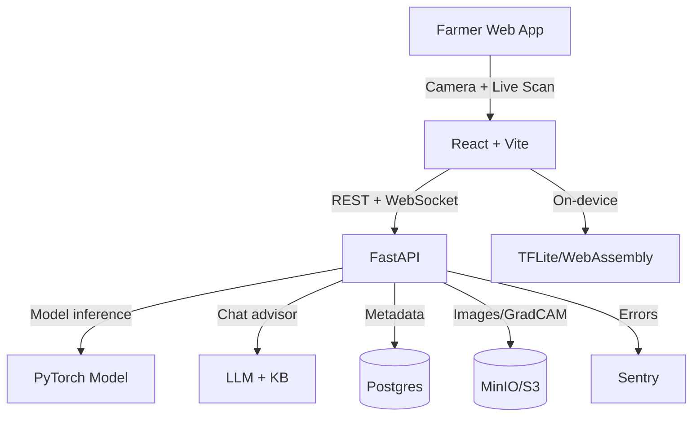

# Architecture

## Components
- Frontend: PWA-friendly React app with live scan, overlays, and chat.
- Backend: FastAPI with inference, live scan WebSocket, and chat advisor.
- ML: Transfer learning model loaded at startup for low-latency inference.
- On-device: TFLite/WebAssembly for low-bandwidth inference.
- Storage: S3-compatible for images and Grad-CAM overlays.
- DB: Postgres for user/session history and feedback labels.

## Deployment
- Single server with Docker Compose for MVP.
- Production S3 endpoint: {REPLACE_WITH_PROD_URL}
